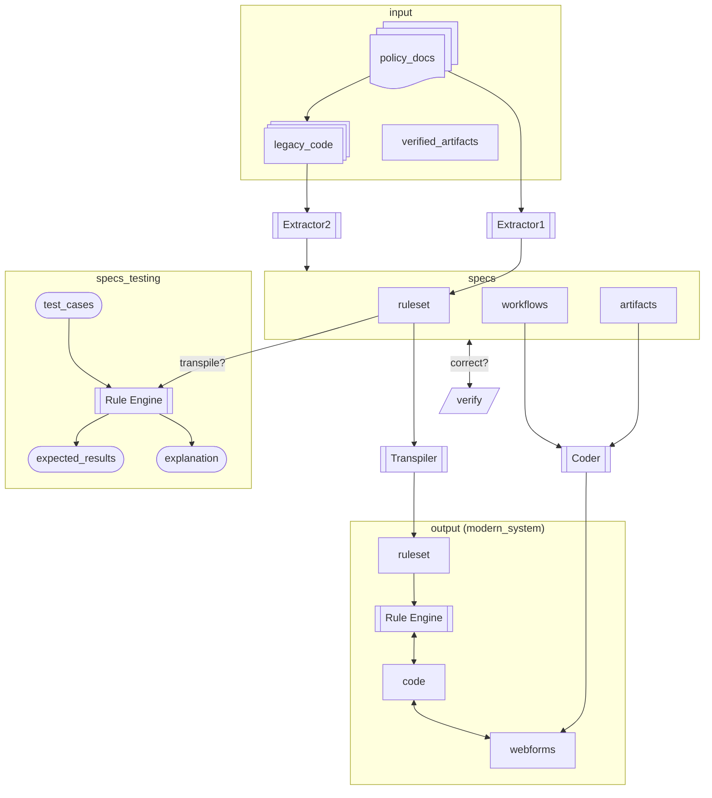

# Legacy Lockpicks: Xlator (Translator) project

Goal: Represent and translate the given input (federal, state, and local government policy documents and code from legacy systems) into specs (intermediate representations of rulesets), following a Rules-as-Code (RaC) approach. To create the output, the specs are used to build the modernized system, quickly building much of the UI workflows to gather the input needed to run the ruleset.

## Key Principles

* Incremental Approach: Work on one program or rule set topic at a time, building confidence before expanding scope.
* Version Control: Commit specs after each logical milestone to track evolution and enable rollback.
* AI Collaboration: Use AI to accelerate translation, but human review ensures accuracy and policy compliance.
* Testing Focus: Comprehensive tests prevent regressions and document expected behavior.

## Step-by-Step Process

This project takes an incremental approach where each iteration involves:
- The user adds `input` docs and code in manageable-sized amounts
    - The codebase contains the input and there is no context window (and hence no limit).
    - The AI searches the codebase for the data it needs (similar to RAG but without a vector DB).
- The user interacts with an AI to update the `specs`. Once satisfied, the specs are commited into git for version control.
    - The user interacts with the AI to create/update the specs (ruleset, workflows, etc.) in manageable amounts.
    - The specs are in a DSL format that will evolve over time.
    - The specs are machine-readable so that it can be used to build the UI workflows.
- Tests for updated specs are added by an AI and verified by the user to ensure future changes do not cause a regression.
- Once a logical set of rules are captured, the user guides the AI to generate `output`, including the ruleset and code to get end-user input and run the ruleset on a given rules engine.
    - A transpiler or converter may be needed to create the output ruleset so that it is usable by the modern system.

### 1. Input Collection
- Add policy documents to `input/policy_docs/`
- Add legacy code to `input/code/`
- Organize by program, jurisdiction, or version

### 2. Spec Creation (AI-Assisted)
- Work with AI to analyze input documents and code
- Create YAML specs in `specs/ruleset/` following `schema.yaml` structure
- Iteratively refine specs through conversation
- Commit completed specs to version control

### 3. Test Definition (AI-Assisted)
- AI generates test cases in `specs/tests/`
- Review and verify test scenarios
- Add edge cases and boundary conditions
- Ensure tests cover policy requirements

### 4. Output Generation
- AI transpiles specs to target rules engine format
- Generated rulesets saved to `output/ruleset/`
- AI generates UI workflow code
- Generated code saved to `output/code/`

### 5. Validation & Iteration
- Run tests against generated outputs
- Validate against original policy documents
- Iterate on specs as needed
- Document any assumptions or interpretations

## Vision diagram

- One incarnation of `Extractor1` is the [Policy Extraction (doc-to-logic) prototype](https://github.com/navapbc/lockpick-doc-to-logic)
- `Extractor2` will likely use AWS Transform, which also produces documentation, which would be included as part of the specs and can be used as input to the Coder.
    - Another option is to include verified output from AWS Transform (noted as `verified_artifacts`) as part of the `input`.

Not yet in the diagram:
- There can be multiple specs that can be compared to identify differences between systems (legacy vs legacy; modern vs modern; legacy vs modern).
- Validating the modern_system against the legacy_system
