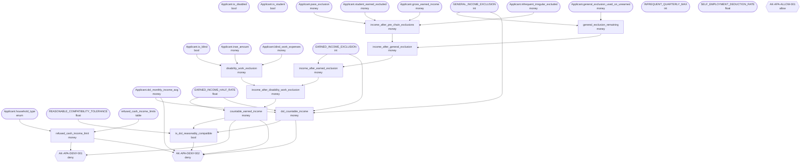

# Computation Graph — ak_doh/apa_adltc

Generated: 2026-03-03

```mermaid
graph TD
  Applicant_household_type(["Applicant.household_type\nenum"])
  Applicant_is_blind(["Applicant.is_blind\nbool"])
  Applicant_is_disabled(["Applicant.is_disabled\nbool"])
  Applicant_is_student(["Applicant.is_student\nbool"])
  Applicant_gross_earned_income(["Applicant.gross_earned_income\nmoney"])
  Applicant_general_exclusion_used_on_unearned(["Applicant.general_exclusion_used_on_unearned\nmoney"])
  Applicant_infrequent_irregular_excluded(["Applicant.infrequent_irregular_excluded\nmoney"])
  Applicant_student_earned_excluded(["Applicant.student_earned_excluded\nmoney"])
  Applicant_irwe_amount(["Applicant.irwe_amount\nmoney"])
  Applicant_blind_work_expenses(["Applicant.blind_work_expenses\nmoney"])
  Applicant_pass_exclusion(["Applicant.pass_exclusion\nmoney"])
  Applicant_dol_monthly_income_avg(["Applicant.dol_monthly_income_avg\nmoney"])
  GENERAL_INCOME_EXCLUSION(["GENERAL_INCOME_EXCLUSION\nint"])
  EARNED_INCOME_EXCLUSION(["EARNED_INCOME_EXCLUSION\nint"])
  EARNED_INCOME_HALF_RATE(["EARNED_INCOME_HALF_RATE\nfloat"])
  INFREQUENT_QUARTERLY_MAX(["INFREQUENT_QUARTERLY_MAX\nint"])
  SELF_EMPLOYMENT_DEDUCTION_RATE(["SELF_EMPLOYMENT_DEDUCTION_RATE\nfloat"])
  REASONABLE_COMPATIBILITY_TOLERANCE(["REASONABLE_COMPATIBILITY_TOLERANCE\nfloat"])
  refused_cash_income_limits(["refused_cash_income_limits\ntable"])
  refused_cash_income_limit["refused_cash_income_limit\nmoney"]
  general_exclusion_remaining["general_exclusion_remaining\nmoney"]
  income_after_pre_chain_exclusions["income_after_pre_chain_exclusions\nmoney"]
  income_after_general_exclusion["income_after_general_exclusion\nmoney"]
  income_after_earned_exclusion["income_after_earned_exclusion\nmoney"]
  disability_work_exclusion["disability_work_exclusion\nmoney"]
  income_after_disability_work_exclusion["income_after_disability_work_exclusion\nmoney"]
  countable_earned_income["countable_earned_income\nmoney"]
  dol_countable_income["dol_countable_income\nmoney"]
  is_dol_reasonably_compatible["is_dol_reasonably_compatible\nbool"]
  AK_APA_DENY_001{{"AK-APA-DENY-001\ndeny"}}
  AK_APA_DENY_002{{"AK-APA-DENY-002\ndeny"}}
  AK_APA_ALLOW_001{{"AK-APA-ALLOW-001\nallow"}}
  Applicant_household_type --> refused_cash_income_limit
  refused_cash_income_limits --> refused_cash_income_limit
  Applicant_general_exclusion_used_on_unearned --> general_exclusion_remaining
  GENERAL_INCOME_EXCLUSION --> general_exclusion_remaining
  Applicant_pass_exclusion --> income_after_pre_chain_exclusions
  Applicant_student_earned_excluded --> income_after_pre_chain_exclusions
  Applicant_gross_earned_income --> income_after_pre_chain_exclusions
  Applicant_infrequent_irregular_excluded --> income_after_pre_chain_exclusions
  income_after_pre_chain_exclusions --> income_after_general_exclusion
  general_exclusion_remaining --> income_after_general_exclusion
  income_after_general_exclusion --> income_after_earned_exclusion
  EARNED_INCOME_EXCLUSION --> income_after_earned_exclusion
  Applicant_is_blind --> disability_work_exclusion
  Applicant_blind_work_expenses --> disability_work_exclusion
  Applicant_irwe_amount --> disability_work_exclusion
  income_after_earned_exclusion --> income_after_disability_work_exclusion
  disability_work_exclusion --> income_after_disability_work_exclusion
  income_after_disability_work_exclusion --> countable_earned_income
  EARNED_INCOME_HALF_RATE --> countable_earned_income
  Applicant_dol_monthly_income_avg --> dol_countable_income
  EARNED_INCOME_HALF_RATE --> dol_countable_income
  EARNED_INCOME_EXCLUSION --> dol_countable_income
  GENERAL_INCOME_EXCLUSION --> dol_countable_income
  dol_countable_income --> is_dol_reasonably_compatible
  countable_earned_income --> is_dol_reasonably_compatible
  REASONABLE_COMPATIBILITY_TOLERANCE --> is_dol_reasonably_compatible
  countable_earned_income --> AK_APA_DENY_001
  refused_cash_income_limit --> AK_APA_DENY_001
  Applicant_dol_monthly_income_avg --> AK_APA_DENY_002
  countable_earned_income --> AK_APA_DENY_002
  refused_cash_income_limit --> AK_APA_DENY_002
  dol_countable_income --> AK_APA_DENY_002
  is_dol_reasonably_compatible --> AK_APA_DENY_002
```
