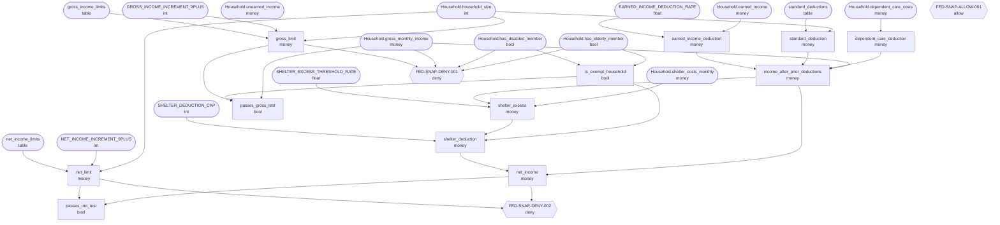

# Computation Graph — snap/eligibility

Generated: 2026-03-03

```mermaid
graph TD
  Household_household_size(["Household.household_size\nint"])
  Household_has_elderly_member(["Household.has_elderly_member\nbool"])
  Household_has_disabled_member(["Household.has_disabled_member\nbool"])
  Household_gross_monthly_income(["Household.gross_monthly_income\nmoney"])
  Household_earned_income(["Household.earned_income\nmoney"])
  Household_unearned_income(["Household.unearned_income\nmoney"])
  Household_shelter_costs_monthly(["Household.shelter_costs_monthly\nmoney"])
  Household_dependent_care_costs(["Household.dependent_care_costs\nmoney"])
  SHELTER_DEDUCTION_CAP(["SHELTER_DEDUCTION_CAP\nint"])
  EARNED_INCOME_DEDUCTION_RATE(["EARNED_INCOME_DEDUCTION_RATE\nfloat"])
  SHELTER_EXCESS_THRESHOLD_RATE(["SHELTER_EXCESS_THRESHOLD_RATE\nfloat"])
  GROSS_INCOME_INCREMENT_9PLUS(["GROSS_INCOME_INCREMENT_9PLUS\nint"])
  NET_INCOME_INCREMENT_9PLUS(["NET_INCOME_INCREMENT_9PLUS\nint"])
  gross_income_limits(["gross_income_limits\ntable"])
  net_income_limits(["net_income_limits\ntable"])
  standard_deductions(["standard_deductions\ntable"])
  earned_income_deduction["earned_income_deduction\nmoney"]
  standard_deduction["standard_deduction\nmoney"]
  dependent_care_deduction["dependent_care_deduction\nmoney"]
  income_after_prior_deductions["income_after_prior_deductions\nmoney"]
  shelter_excess["shelter_excess\nmoney"]
  is_exempt_household["is_exempt_household\nbool"]
  shelter_deduction["shelter_deduction\nmoney"]
  net_income["net_income\nmoney"]
  gross_limit["gross_limit\nmoney"]
  net_limit["net_limit\nmoney"]
  passes_gross_test["passes_gross_test\nbool"]
  passes_net_test["passes_net_test\nbool"]
  FED_SNAP_DENY_001{{"FED-SNAP-DENY-001\ndeny"}}
  FED_SNAP_DENY_002{{"FED-SNAP-DENY-002\ndeny"}}
  FED_SNAP_ALLOW_001{{"FED-SNAP-ALLOW-001\nallow"}}
  Household_earned_income --> earned_income_deduction
  EARNED_INCOME_DEDUCTION_RATE --> earned_income_deduction
  Household_household_size --> standard_deduction
  standard_deductions --> standard_deduction
  Household_dependent_care_costs --> dependent_care_deduction
  Household_gross_monthly_income --> income_after_prior_deductions
  dependent_care_deduction --> income_after_prior_deductions
  standard_deduction --> income_after_prior_deductions
  earned_income_deduction --> income_after_prior_deductions
  Household_shelter_costs_monthly --> shelter_excess
  income_after_prior_deductions --> shelter_excess
  SHELTER_EXCESS_THRESHOLD_RATE --> shelter_excess
  Household_has_elderly_member --> is_exempt_household
  Household_has_disabled_member --> is_exempt_household
  is_exempt_household --> shelter_deduction
  shelter_excess --> shelter_deduction
  SHELTER_DEDUCTION_CAP --> shelter_deduction
  income_after_prior_deductions --> net_income
  shelter_deduction --> net_income
  Household_household_size --> gross_limit
  GROSS_INCOME_INCREMENT_9PLUS --> gross_limit
  gross_income_limits --> gross_limit
  Household_household_size --> net_limit
  NET_INCOME_INCREMENT_9PLUS --> net_limit
  net_income_limits --> net_limit
  Household_gross_monthly_income --> passes_gross_test
  is_exempt_household --> passes_gross_test
  gross_limit --> passes_gross_test
  net_income --> passes_net_test
  net_limit --> passes_net_test
  Household_has_elderly_member --> FED_SNAP_DENY_001
  Household_has_disabled_member --> FED_SNAP_DENY_001
  Household_gross_monthly_income --> FED_SNAP_DENY_001
  gross_limit --> FED_SNAP_DENY_001
  net_income --> FED_SNAP_DENY_002
  net_limit --> FED_SNAP_DENY_002
```
